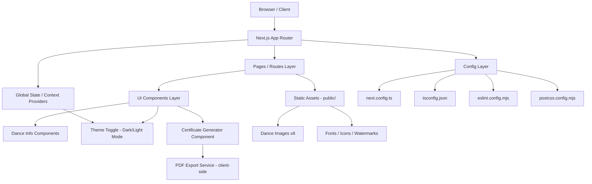
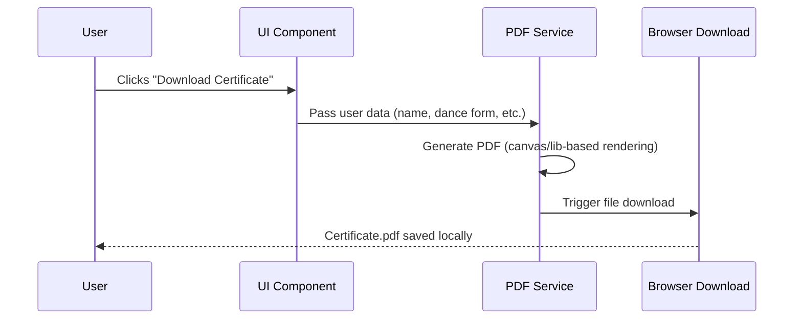

# Rhythmdance 💃

A web application celebrating India's classical dance heritage — explore all 8 classical dance forms of India, complete with a modern, accessible UI, dark mode, and downloadable certificates.

## ✨ Features

- **8 Classical Dance Forms** — Dedicated content and unique imagery for each of India's classical dances
- **Dark Mode** — Toggle between light and dark themes for comfortable viewing
- **Certificate Generation** — Download personalized certificates as PDF
- **Modern UI** — Clean, responsive interface with a polished startup splash screen
- **Fast & Type-Safe** — Built with Next.js and TypeScript for performance and reliability

## 🛠️ Tech Stack

- **Framework:** [Next.js](https://nextjs.org/) (App Router)
- **Language:** TypeScript
- **Styling:** CSS / PostCSS
- **Linting:** ESLint
- **PDF Generation:** Client-side certificate export

## 🏗️ Software Architecture

Rhythmdance follows a **layered, component-based architecture** typical of modern Next.js applications — separating presentation, business logic, and static assets into distinct layers for maintainability and scalability.

### High-Level Architecture Diagram



### Architectural Layers

| Layer | Responsibility | Location |
|---|---|---|
| **Presentation Layer** | Renders pages, routes, and layouts | `src/app/` or `src/pages/` |
| **Component Layer** | Reusable UI building blocks (dance cards, theme toggle, footer watermark, etc.) | `src/components/` |
| **State/Context Layer** | Manages global state such as dark mode toggle | `src/context/` or `src/hooks/` |
| **Service Layer** | Business logic — e.g., PDF certificate generation | `src/lib/` or `src/utils/` |
| **Static Assets** | Dance images, icons, fonts, watermark graphics | `public/` |
| **Configuration** | Build, lint, type-checking, and styling configs | Root-level config files |

### Key Architectural Decisions

- **Next.js App Router** is used for file-based routing, enabling clean separation between static dance-info pages and dynamic behavior (certificate generation).
- **Client-side PDF generation** keeps certificate creation fast and serverless — no backend round-trip is required to render a downloadable PDF.
- **Theme state (dark/light mode)** is managed via React Context so any component in the tree can read/update the theme without prop drilling.
- **TypeScript throughout** enforces type safety across components, props, and utility functions, catching errors at build time.
- **Static assets are pre-bundled**, with each of the 8 classical dance forms shipping its own unique image set, served directly via Next.js's optimized asset pipeline.

### Data Flow (Certificate Download Example)



> **Note:** This architecture is inferred from the visible project structure (Next.js + TypeScript, `public/`, `src/`, PDF/certificate features, dark mode). For a diagram that exactly matches your actual folder/module structure, share your `src/` tree or repo access and this section can be updated precisely.

## 🚀 Getting Started

### Prerequisites

- [Node.js](https://nodejs.org/) (LTS recommended)
- npm (comes with Node.js)

### Installation

1. Clone the repository
   ```bash
   git clone https://github.com/heygaurav22/rhythmdance.git
   cd rhythmdance
   ```

2. Install dependencies
   ```bash
   npm install
   ```

3. Run the development server
   ```bash
   npm run dev
   ```

4. Open [http://localhost:3000](http://localhost:3000) in your browser to see the app.

### Build for Production

```bash
npm run build
npm start
```

## 📁 Project Structure

```
rhythmdance/
├── public/          # Static assets (images, icons, etc.)
├── src/             # Application source code
├── old proj/        # Legacy/previous version of the project
├── AGENTS.md         # Notes/config for AI coding agents
├── CLAUDE.md          # Notes/config for Claude-based tooling
├── eslint.config.mjs
├── next.config.ts
├── postcss.config.mjs
├── tsconfig.json
└── package.json
```

## 📜 Available Scripts

| Command         | Description                          |
|-----------------|---------------------------------------|
| `npm run dev`   | Starts the development server         |
| `npm run build` | Builds the app for production         |
| `npm start`     | Runs the production build             |
| `npm run lint`  | Runs ESLint checks                    |

## 🤝 Contributing

Contributions are welcome! To contribute:

1. Fork the repository
2. Create a feature branch (`git checkout -b feature/your-feature`)
3. Commit your changes (`git commit -m 'Add some feature'`)
4. Push to the branch (`git push origin feature/your-feature`)
5. Open a Pull Request

## 📄 License

This project is licensed under the **Apache License 2.0** — see the [LICENSE](./LICENSE) file for details.

## 👥 Contributors

- [heygaurav22](https://github.com/heygaurav22)
- [heyaurav01](https://github.com/heyaurav01)

---

Made with ❤️ to celebrate the art of Indian classical dance.
